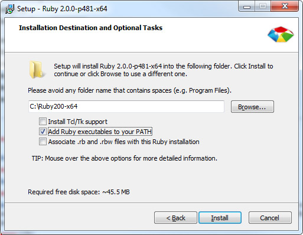

#Ruby

The underlying programming language on which the other platforms and frameworks run.

Ruby is required to install / run the **ruby version of Sass** (there is an alternative Nodejs version).

##Installing Ruby
1. Download the latest version from http://rubyinstaller.org/downloads/.
2. Run installation.

    Make sure that the ***Add Ruby executables to your PATH*** option is selected.

    

###Links
- https://www.ruby-lang.org/en/
- http://rubyinstaller.org/downloads/
- http://css-plus.com/2014/05/install-sass-and-compass/
